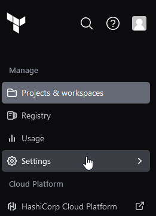
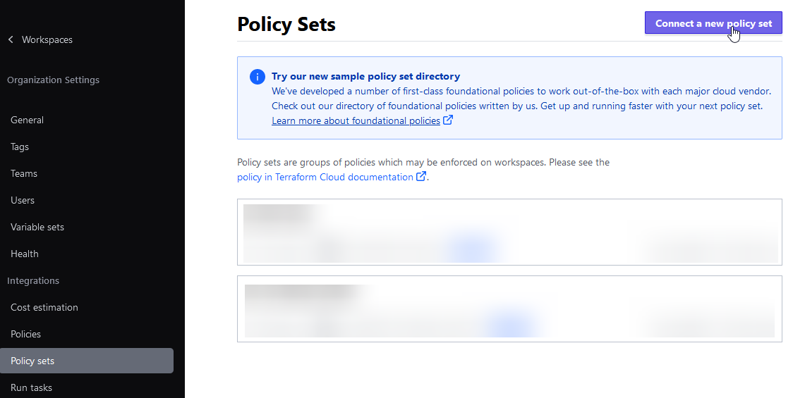
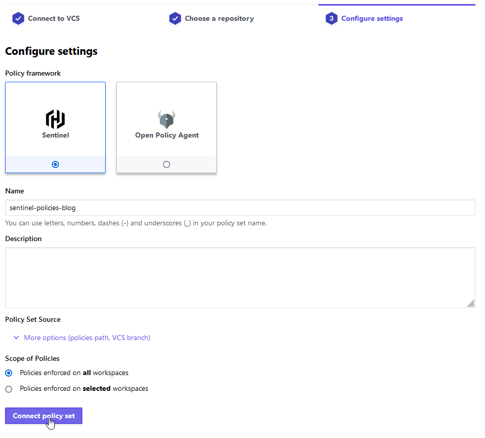

# Getting Started with Sentinel: Part 4 - Integrating with Terraform Cloud

In previous posts, we covered the basics of Sentinel, how to write a simple policy and a real-world application of Sentinel. In this post, we'll cover how to integrate Sentinel with Terraform Cloud and how to use it to enforce a cost management policy.

If you haven't read parts 1, 2 and 3, I recommend you do so before continuing. You can find them here:

- [Part 1]()
- [Part 2]()
- [Part 3]()

In this post, we'll cover the following:

- Using Sentinel to enforce a cost management policy
- Using the Terraform Cloud UI to view policy violations
- Integrating a Sentinel VCS repository with Terraform Cloud

## Cost Management with Sentinel

In the previous post we saw how to use Sentinel to enforce tagging policies, in this section, we'll use Sentinel to enforce cost management, and use a common deployment convention by integrating with a VCS provider.

A built-in function of Terraform Cloud and Terraform Enterprise is the [cost estimation](https://www.terraform.io/docs/cloud/cost-estimation) functionality that estimates the cost of infrastructure changes. Coupled with Sentinel We can enforce a cost threshold on changes to your infrastructure. Let's take a look at another example, this time instead of limiting ourselves to the [Sentinel Playground](https://play.sentinelproject.io/) we'll create a GitHub repository and integrate it directly with Terraform Cloud or Enterprise.

### Creating a Cost Management Policy

In this example, we'll create a policy that limits a workspace budget to a maximum cost of $100 per month using both Sentinel and Terraform Cost Estimation.
In my example, I'll be using GitHub but you can use any VCS provider that Terraform Cloud or Enterprise [supports](https://developer.hashicorp.com/terraform/cloud-docs/vcs#supported-vcs-providers). If you don't have a GitHub account, you can create one [here](https://github.com/join). Once you have an account, you can create a new repository by clicking the `+` in the top right corner and selecting `New repository`. Give your repository a name, I'll call mine `sentinel-policies-blog` then click `Create repository`.

Before we start writing our policy let's break down the requirements:

- We need to be able to get the cost estimate from Terraform Cloud or Enterprise
- We need to be able to compare the cost estimate to a threshold
- We need to be able to return a pass or fail result

Before we can write our policy, we need to know what data is available to us. We can find that out by generating some mock data. In Terraform Cloud/Enterprise create a new workspace and write some basic Terraform to spin up an EC2 instance. I'm fairly confident that an AWS instance size of `m5.24xlarge` will be sufficiently higher than our threshold, so let's use that to both generate our mock data and provide a failing test case.

```go
data "aws_ami" "ubuntu" {
  most_recent = true

  filter {
    name   = "name"
    values = ["ubuntu/images/hvm-ssd/ubuntu-focal-20.04-amd64-server-*"]
  }

  filter {
    name   = "virtualization-type"
    values = ["hvm"]
  }

  owners = ["099720109477"] # Canonical
}

resource "aws_instance" "demo" {
  ami = data.aws_ami.ubuntu.id

  instance_type = "m5.24xlarge"

  tags = {
    "Name" = "Demo Instance"
    "TTL"  = "1h"
  }
}
```

Once you've created your workspace, and have run a plan (I wouldn't recommend applying, especially if you used a `m5.24xlarge` instance size like I did) you can go to the Runs tab and `Download Sentinel mocks`.

In the root of your repository, create a new file called `restrict-expensive-workspaces.sentinel`. Previously we've been using `import tfplan` and `import tfplan/v2 as tfplan` to check for misconfigurations. The `tfplan` mock data is exactly that, the _plan_ that Terraform generates, but that doesn't contain cost data. To get cost data we need to use `tfrun` since cost estimation is only available on runs.

Here's the portion of the `mock-tfrun.sentinel` mock data that contains the cost estimate:

```go
cost_estimate = {
	"delta_monthly_cost":    "3428.352",
	"prior_monthly_cost":    "0.0",
	"proposed_monthly_cost": "3428.352",
}
```

And here's our policy `restrict-expensive-workspaces.sentinel`:

```go
import "tfrun"
import "decimal"

proposed_monthly_cost = decimal.new(tfrun.cost_estimate.proposed_monthly_cost)

main = rule {
  proposed_monthly_cost <= decimal.new(1000)
}
```

As we've done in the past, let's break down this code:

- We import the `tfrun` mock data from `mock-tfrun.sentinel`
- We import the [`decimal` library](https://docs.hashicorp.com/sentinel/imports/decimal)
- We create a new decimal value from the `proposed_monthly_cost` value in the `tfrun` mock data
- We create a rule that checks if the `proposed_monthly_cost` is less than or equal to 1000

### VCS Integration

Let's take everything we've created here and create a new git repository, push it to our VCS provider of choice and integrate it with Terraform Cloud or Enterprise.

First, let's create a new folder locally, I'll call mine `sentinel-policies-blog` then initialize a new git repository, layout our folder structure and add a boilerplate `.gitignore` file:

```bash
mkdir sentinel-policies-blog
cd sentinel-policies-blog
git init
mkdir -p test/restrict-expensive-workloads
touch sentinel.hcl
curl -s https://www.toptal.com/developers/gitignore/api/terraform > .gitignore
```

Let's use our cost management policy `restrict-expensive-workspaces.sentinel` and save it in the root folder. Next, let's edit `sentinel.hcl` and add the following:

```go
policy "restrict-expensive-workspaces" {
  enforcement_level = "hard-mandatory"
}
```

Next extract the contents of the mocks `.tar.gz` file you downloaded from Terraform Cloud/Enterprise into the `restrict-expensive-workloads` folder.

Okay, that was a lot. We should end up with a folder structure that looks like this:

```
.
├── mocks
│   ├── restrict-expensive-workspaces-mock-tfconfig.sentinel
│   ├── restrict-expensive-workspaces-mock-tfconfig-v2.sentinel
│   ├── restrict-expensive-workspaces-mock-tfplan.sentinel
│   ├── restrict-expensive-workspaces-mock-tfplan-v2.sentinel
│   ├── restrict-expensive-workspaces-mock-tfrun.sentinel
│   ├── restrict-expensive-workspaces-mock-tfstate.sentinel
│   └── restrict-expensive-workspaces-mock-tfstate-v2.sentinel
├── restrict-expensive-workspaces.sentinel
├── sentinel.hcl
```

With all of this in place we're ready to push our code to our VCS provider. If you're using GitHub, you can create a new repository by clicking the `+` in the top right corner and selecting `New repository`. Give your repository a name, I'll call mine `sentinel-policies-blog` then click `Create repository`. Next, copy the `git remote add` command that GitHub provides and run it locally.

```bash
git add .
git commit -m "Initial commit"
git push -u origin main
```

### Connect VCS Repository to Terraform Cloud

In Terraform Cloud, navigate to your Organization then click `Settings`.



Next, click `Policy Sets` then `Connect a new policy set`.



Select your VCS provider, or `Connect to a different VCS provider` if you're using a different provider. Next, select the repository you created in the previous step, then click `Connect policy set`.



Congratulations! You've successfully completed this section by creating a new policy, uploaded it to a VCS provider and connected it to Terraform Cloud. In the next, and final section we'll bring in some standardizations and reusable modules to make our policies more maintainable.